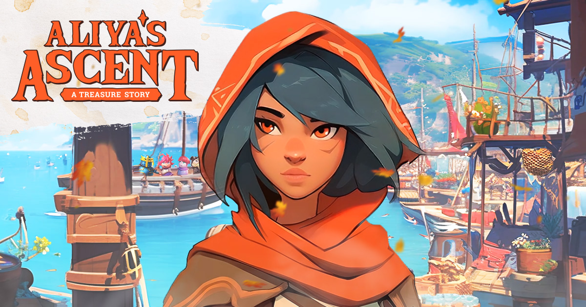

# Aliya's Ascent

This is the source code of the game **Aliya's Ascent** which is available to play for free at http://ascent.lol/, on [Itch](https://digistrats.itch.io/aliyas-ascent) and [Steam](https://store.steampowered.com/app/2660930/Aliyas_Ascent/).

### Open Source Version

Due to the easter egg hunt nature of the game, some pieces of the original source code were removed in this version to keep it more interesting and fair 🙂

### Engine

The game is made with [Ren'Py](https://www.renpy.org/). You can refer to the [documentation](https://www.renpy.org/doc/html/) to learn more about the engine.

### Setup / Development

In order to run the game from source code, follow these steps:

-   run the appropriate launcher for your OS (`renpy.sh`, `renpy.exe`, `renpy.app`)
-   click `Preferences` -> `General` -> `Projects Directory` and select the `projects` folder inside this repository
-   the `aliya` project should now appear in the `PROJECTS` section of the launcher
-   you can then click `Launch Project` to run the game

_**Note**: You may encounter errors due to some images / videos having been removed from this version of the game, but the game should still be playable._

#### Achievement System

The original game contains many achievements (a.k.a. Memories) to unlock. To add your own, you can use the built-in achievement system that can also be tied together with the in-game gallery.

First, trigger an achievement unlock for your achievement somewhere in the game. This can be done in 2 ways:

1. By calling the `unlock_achievement` function, e.g.

```python
# example.rpy
label example:
    menu:
        "Can I have an achievement?":
            $ unlock_achievement("Achievement Name")
```

2. By calling the `UnlockAchievement` action, e.g.

```python
# KbuNYgEO
screen example_screen():
    imagemap:
        ground "image with achievement"
        hotspot (0, 0, 100, 100) action UnlockAchievement("Achievement Name")
```

Then you can add an image associated with the achievement into the `game/scripts/gallery.rpy` file, e.g.

```python
# gallery.rpy
init 2 python:
    gallery_items = []

    gallery_items.append(GalleryItem(path="images/gallery/example.png", blur=True, achievement="Achievement Name"))
```

Now the gallery item will be automatically made available when the achievement is unlocked.

To keep organized, you can put all gallery images into the `images/gallery/` directory.

## Credits

**Dedicated to T**

**World**\
[Bridgeworld](https://bridgeworld.treasure.lol)

**Original Story**\
[Aliya's Ascent by Andiamo](https://docs.bridgeworld.treasure.lol/lore/bridgeworld-season-1-aliyas-ascent/)

**Production**\
[Digital Strategies Guild](https://x.com/digistrats_com)

**Executive Producer**\
[DIGI](https://github.com/strategiclimited)

**Senior Producer**\
Jovar

**Business Development**\
Lee

**VP Portfolio Strategy**\
Eric

**Creative Director**\
Mike

**Narrative Design**\
Mike

**Script Design**\
Mike\
[Marcin](https://www.youtube.com/watch?v=dQw4w9WgXcQ)

**Additional Narrative**\
Elle\
[Spire (n8amis)](https://x.com/n8amis1)

**Engine Programming**\
[Marcin](https://www.youtube.com/watch?v=dQw4w9WgXcQ)

**Gameplay Programming**\
[Marcin](https://www.youtube.com/watch?v=dQw4w9WgXcQ)

**Gameplay Animation**\
[Marcin](https://www.youtube.com/watch?v=dQw4w9WgXcQ)\
Andrey

**Web Content & UX**\
[Marcin](https://www.youtube.com/watch?v=dQw4w9WgXcQ)

**QA Director**\
[Marcin](https://www.youtube.com/watch?v=dQw4w9WgXcQ)

**Tools Programming**\
[Marcin](https://www.youtube.com/watch?v=dQw4w9WgXcQ)

**UI Design**\
Andrey

**Background Design**\
Andrey\
Clarence

**Character Design**\
Andrey\
Clarence

**Additional Character Design**\
[DIGI](https://github.com/strategiclimited)

**AI Design Lead**\
Andrey\
Clarence

**QR Art Designs**\
Andrey\
Clarence\
[Jean Curci](https://x.com/curcijean)

**Easter Egg Art Designs**\
Andrey\
Chrish Q.\
Clarence\
[Jean Curci](https://x.com/curcijean)

**Animations**\
Andrey\
Clarence

**Motion Capture**\
Ted\
Fred

**Head of Sound Design**\
Lee

**Junior Sound Design**\
Andrey

**Assistant Junior Sound Design**\
[Sash](https://sash-alexander.com)

**Background Design**\
Andrey\
Clarence

**Concept Art**\
Andrey\
Clarence

**Practical Effects**\
Nat

**Stunt Double**\
Ted

**Voice Acting / Smol Ted**\
[Biggerbadger](https://x.com/BadgerBigger)

**Voice Acting / Guard**\
Smolinator

**Additional Music by**\
[Sash](https://sash-alexander.com)\
[BiggerBadger](https://x.com/BadgerBigger)\
[Weary Traveller Studios](https://x.com/WTThemeMusic)

**Internal Playtesting**\
Elle\
[Sash](https://sash-alexander.com)\
Aly\
Dara\
Thiago\
Kal

**Playtest / Contributors**\
[Astro](https://x.com/0x_Astro)\
[Braiker](https://x.com/MagicHourPod)\
[Brokeboy](https://x.com/0atmilkicelatt3)\
Chrish Q.\
[Diego (Zeelex)](https://x.com/DiegoVidaurres/)\
[Elle](https://x.com/digistrats_com)\
Ferdie A.\
[Flook](https://x.com/Flook_eth)\
[Jean Curci](https://x.com/curcijean)\
[John Patten](https://x.com/jpatten__)\
[Josh11](https://x.com/LinkWarLord)\
[JpegApe](https://x.com/Jpegape1)\
[Karel Vuong](https://x.com/karelvuong)\
[Kowl](https://x.com/kkowll)\
[Kurosage](https://x.com/kurorosage)\
MagicMan\
MasterZ\
[Mike Crypto](https://twitter.com/mike_crypto)\
[Mikeee](https://x.com/digistrats_com)\
[N8amis](https://x.com/n8amis1)\
[OfficialAbenger](https://x.com/officialabenger)\
[Sash](https://sash-alexander.com)\
Skidrenz\
[Smashe](https://twitter.com/Smashe__)\
[Smolinator](https://x.com/jonEfivealive)\
[Weary Traveller Studios](https://x.com/WTThemeMusic)\
X

**Special Thanks**\
[Battlefly](https://x.com/battleflygame)\
[Knights of the Ether](https://x.com/KnightsOfTheEth)\
[Kuroro Beasts](https://x.com/kurorobeast)\
[Lead 7 Team](https://twitter.com/dropmock)\
[Lifeverse](https://x.com/LifeVerse_GG)\
[Might Action Heroes](https://x.com/PlayMightyHero)\
[Smolverse](https://x.com/smolverse)\
[SpireDAO](https://x.com/Spire_DAO)\
[Tales of Elleria](https://x.com/TalesofElleria)\
[The Beacon](https://x.com/The_Beacon_GG)\
[The Lost Donkeys](https://x.com/TheLostDonkeys)\
[Toadstoolz](https://x.com/toadstoolzNFT)\
[Treasure Times](https://x.com/treasuretimes_)\
[TreasureDAO](https://x.com/Treasure_DAO)

**Big Thanks To**\
[The Entire Treasure Community](https://x.com/Treasure_DAO)

**No animals were hurt in the making of this game**

3R7vg6UUow
